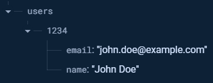

# Entry 2
##### 12/17/23

### Content:
Learning Firebase has been a challenging experience because there are a lot of different components, such as `authentication` and `real-time database`. One thing that I have been frequently doing is reading the Firebase [documentation](https://firebase.google.com/docs). This allowed me to learn about how to structure `data` in real-time databases using `JSON`.



Another major source of my learning has been [YouTube](https://www.youtube.com/). From [here](https://youtu.be/9bXhf_TELP4?si=CKlD8dSdjkFUh6wN) I learned how to create user accounts to login using Firebase. In addition, from this [video](https://youtu.be/dx_gkSb-Ch0?si=aesM9zS1EsZ2fAvO) I learned about different Firebase rules, which affect how you access the database. I learned from this by modifying the rules in my own test database.

```json
{
    "rules": {
        "users": {
            "$user": {
                "read": '$user == "Bob"'
            }
        }
    }
}
```

Finally, I followed along with this [tutorial](https://youtu.be/PngrpszT3aY?si=Q2iPQ5u2uB3dUY-N) to create a [website](../tool/firebase-react) using React and Firebase, where you must be logged in with an account to access a private page. I changed variable names and modified the content that was displayed to better develop my learning. I learned how to create private routes that restrict access to certain pages. For example, you can require an account to access `/private`. I also learned how to create separate forms for registering a user and logging a user into the website. I also continued to develop my knowledge of `useState` in React.

```js
const [email, setEmail] = useState("");
const [password, setPassword] = useState("");
```

My goal for winter break is to complete the static React portion of the website. This means completing all the front-end work that is not related to Firebase, such as the home and about pages. To be more productive, I plan on reactivating my library card so that I can work in the [library](https://www.bklynlibrary.org/) near me. I also plan on following more Firebase tutorials and reading more documentation.

### EDP:
I am currently in stages **2 and 3** of the engineering design process. I have been researching **Firebase** by watching tutorials and reading [documentation](https://firebase.google.com/docs). This has allowed me to read about different authentication methods and ways to store information in a real-time database. This transitions to stage 3, where I am actively trying out different things that I have learned and trying out new things from tutorials.

### Skill:

I have grown in the skills of **debugging** and **logical reasoning** by working on this project. One of the reasons for this is that Firebase can be difficult to understand because there are a lot of different parts depending on what you are trying to do. This means being extra careful because a simple misspelling can break all your code. In addition, I switched over to **Arch Linux** which means I am consistently dealing with bugs and how to fix complicated system errors, which takes a lot of reasoning. This also led to me improving my **how to google** skills because I would have to research very specific issues such as *"how to install OpenVPN on arch gnome desktop environment"* or *"how to switch kernel on arch Linux"*. I also had to **embrace failure** since, as I am writing this, I need to reset my laptop since there are network errors because I did not set up my computer properly and did commands that seem to have corrupted my system. I just have to accept this and spend hours reconfiguring a new install, unfortunately.

[Previous](entry01.md) | [Next](entry03.md)

[Home](../README.md)
