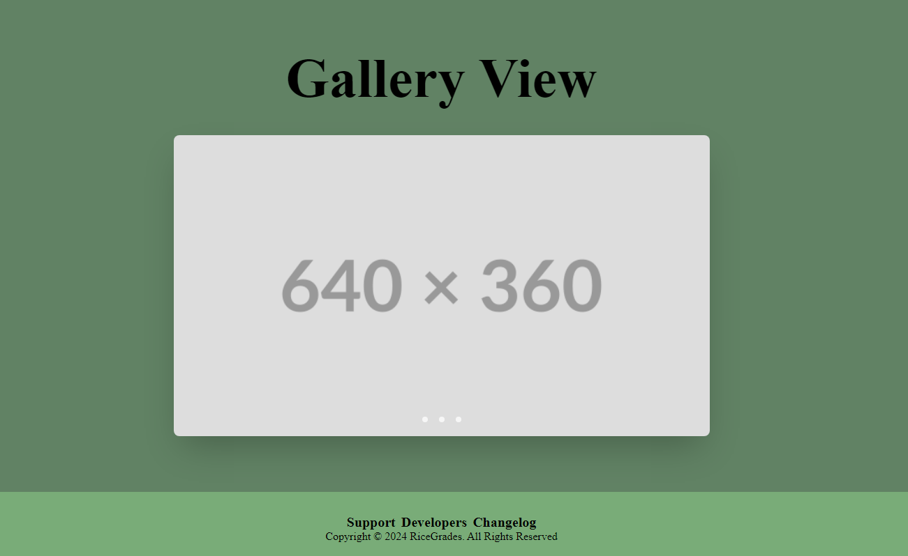

# Entry 4
##### 3/17/24

### Content:
Although my main tool this year is Firebase, recently I have been learning Flexbox to help get the front end done for my project. By learning Flexbox, I was able to do stuff not possible before and get a better understanding of CSS without needing to rely on a framework such as [bootstrap](https://getbootstrap.com/).

To learn Flexbox, I first watched several different YouTube [tutorials](https://youtu.be/3YW65K6LcIA?si=bwqdHRAnqh7692S9) so that I had a good understanding of all the main concepts. I also read several different online [guides](https://css-tricks.com/snippets/css/a-guide-to-flexbox/#aa-flexbox-properties) so that I could have something to reference while I was still learning the correct syntax. The first thing I learned about was `display: flex` which created a flexbox container. The next concept I learned was `flex-direction` which indicates if you want to orient your content horizontally or vertically. I then learned about `justify-content`, which determines the orientation of elements on the main axis, and `align-items`, which determines the orientation of elements on the secondary axis. The final thing I learned before getting started was `gap`, which lets you put a space between elements similar to padding. I then used what I learned to develop a layout for the [homepage](https://ricegrades.pages.dev/).

```css
.header .container {
    display: flex;
    justify-content: space-around;
    align-items: center;
    padding: 10rem 2rem 10rem 2rem;
    gap: 3rem;
}
```

A significant amount of progress has been made towards my MVP. I completed the home, support, and developers pages all on my own using no CSS framework. I have also been able to make the support form work by having the content of the message sent as a Discord webhook instead of relying on an email server. Our biggest obsession as a team has previously been web design because none of us were very knowledgeable in this field. However, by stepping up and developing these skills, I was now able to help our group get back on schedule with our development progress.



### EDP:
I am currently in stages **4 and 5** of the engineering design process. In my previous entry, I talked about looking for templates to create a solution; I am proud to say that is no longer necessary. As I mentioned in my content section, I have been learning Flexbox to improve my skills and web design, which allowed me to start creating a prototype for my project from scratch and with collaboration from my teammates. Although we are still planning the different viewing panels depending on your account type, the prototype for the static pages such as [developers](https://ricegrades.pages.dev/developers) and [support](https://ricegrades.pages.dev/support), has been completed.

### Skill:
I have further grown in the skill of **problem decomposition** because of the Pathfinders internship program. I am currently a web developer for [Universal Phoenix Group LLC](https://www.upg-corp.com/) which means I constantly have to break down my assignments so that I don't get burned out and can deliver the best quality of work. In addition, this internship has led to me growing in my **collaboration** skills. I was initially placed on a game development team, resulting in the need to practice self-advocacy when telling my supervisor I wasn't knowledgeable enough to be a valuable member of the team. This was hard for me to do, but I am happy I had that conversation because now I am part of a team where I have enough knowledge and experience to help get stuff done. This also led to me developing **debugging** skills because my current assignment has been to fix the typescript errors in the project so that everything can properly compile.

[Previous](entry03.md) | [Next](entry05.md)

[Home](../README.md)
