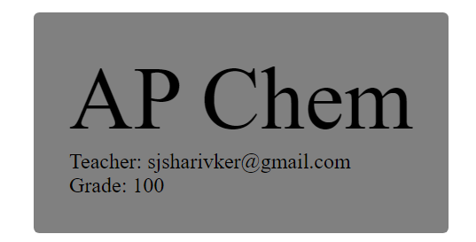

# Entry 5
##### 5/5/24

### Content:
I have mostly been learning my tool, Firebase, through hands-on trial and error while working on my MVP, which is a grading app. I also read the [documentation](https://firebase.google.com/docs/database/web/read-and-write) for the real time database function to get a better understanding of how to `structure` and `read` data. I also continued to watch tutorials on YouTube, such as this [one](https://youtu.be/7hB2ASYBkXo?si=xUnr8Xcs1lR7mpOQ) to reinforce the concepts mentioned in the documentation. It was also helpful that one of my team members, **Yu** was also learning firebase, so we were able to help each other understand all the concepts.

Finishing my MVP took a lot of hours and sleepless nights to get the job done. It wasn't because of procrastination; it was just that some parts of the project took a lot of brainstorming on what to do. For example, I was trying to figure out how to handle assignments, which is going to be a feature beyond MVP. As I was going for a run, I realized that I can have a separate table in my database that takes in an `assignment name, the classroomID it is associated with, the assignment type, student email, and grade`. This seems simple now, but at the time, it was difficult to figure out.

The main thing I had in mind when working on the MVP was to not focus on appearance or design because that was something I could work on later. I went in the order of designing the login page, then working on the teacher page, and then working on the student page. Each of these took days to complete and a lot of discord calls with Ben and Yu, but in the end, we managed to get it all completed. I am very grateful that I had such hardworking and supportive team members because I would not have been able to complete this project without them.

I finished the login page MVP by making it so that if the user is already logged in, they will automatically be directed to the correct page. For example, if the user is a **student** they will get redirected to the `/student` page. I implemented this by searching through the `users` table in my database to check for the authenticated user's role. I then used the `useState()` hook to update a variable called role so that the user would be redirected to the correct page.
```js
if (user) {
    getUserRole(user.uid)
    .then((userRole) => {
        setRedirect(userRole);
    })
    .catch((error) => {
        console.error("Error fetching user role:", error);
    });
}

if (redirect) {
    return <Navigate to={`/${redirect}`}></Navigate>;
}
```

I finished the teacher page MVP by allowing teachers to create a classroom by pressing a button and then filling out information through prompts. However, in the future, I plan on changing this to a popup form to be of higher quality and more user-friendly. I then worked on making sure teachers could only add students to a classroom if they were already in the database to make sure no random fake email addresses were used.
```js
finalStudentsArray.forEach((i) => {
    getStudents(i)
    .then((result) => {
        if(result === null) {
            const index = finalStudentsArray.indexOf(i);
            finalStudentsArray.splice(index, 1);
            errorToast(`${i} does not have an account. Please have the student register first!`);
        }
    })
})

```

I then worked on displaying the classroom to the teacher, which allows the teacher to remove students from the class by clicking on a student's name in a dropdown, as well as updating grades by clicking students in a different dropdown menu. This all required different sub-functions, such as [updateStudentGrade](https://github.com/code2cube/RiceGrades/blob/main/src/pages/Teacher.jsx#L106) and [addStudent](https://github.com/code2cube/RiceGrades/blob/main/src/pages/Teacher.jsx#L171). I then add to use `DOM` concepts to compile all the information and display specific information for different classes. The page took over 500 lines of code, hours of debugging, and going to bed at 3 a.m. in order to meet our deadlines and goals.
```js
const b = document.createElement("p");
b.innerHTML = `Number of Students: ${classroom.students.length}`;
b.classList.add("student-count-display")
```

After completing the teacher page, the student page was much simpler because all the concepts were something I was now familiar with and had code that just needed to be modified. I just had to see what classes a user was in and then display the `classroom name, teacher, and the student's grade`. I checked what classrooms a user was in by iterating through every classroom in the database and checking if the user's email was part of the `students` array in each classroom. If they were, then that means the student is part of that classroom.
```js
function getClassrooms() {
    return new Promise((resolve, reject) => {
        const dbRef = ref(db);
        get(child(dbRef, 'classrooms/')).then((snapshot) => {
            if (snapshot.exists()) {
                const data = snapshot.val();
                for (let key in data) {
                const students = data[key].students;
                if(students.includes(user.user.email)) {
                    data[key].grades.forEach((i) => {
                    if(i.student === user.user.email) {
                        displayClassroom(data[key], i.grade)
                        console.log(`You are part of ${data[key].name} taught by ${data[key].teacher}. Your grade is ${i.grade}`);
                    }
                    })
                }
                }
            } else {
                displayClassroom(null);
            }
        }).catch((error) => {
            console.log(error);
            reject(error);
        })
    });
}

getClassrooms()
```


### EDP:
I am currently in stages **6 and 7** of the engineering design process. I finished making a working MVP of my grading app; however, I am constantly testing the different features and working on bug testing to make sure the user experience is the best it can be. I am also working on improvements such as an assignment feature and user authentication emails, which are part of the beyond MVP phase.

### Skill:
I have grown in the skill of **debugging** because this whole project has been dealing with tons of bugs. For example, while working on the student dropdown so teachers can remove students from a classroom, I was dealing with a bug where when you tried to close the dropdown, it would repeatedly duplicate the displayed classroom. I fixed this by using the `useState()` variable to check if the dropdown was open or closed. I have also grown in the skill of **leadership** because, during the week of spring break, I had to make sure my team got our MVP done. I made sure we all had a task to work on and that deadlines were being met. I also set a good example as a leader by spending additional time during the week to fix any bugs or technical difficulties that members of the team faced during that week. I also worked on quality of life stuff, such as adding a Discord webhook to our [project](https://github.com/code2cube/RiceGrades) so we can be notified when someone pushes a change so we can pull.

[Previous](entry04.md) | [Next](entry06.md)

[Home](../README.md)
