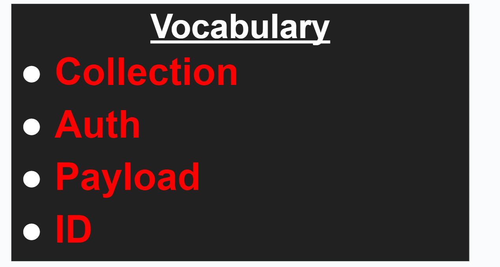

# Entry 6
##### 5/5/24

### Content
When it came to giving the in-class presentation, I wasn't nervous because I had prepared and had spent so many hours on my project that I knew even if I forgot everything I would be able to wing it. I had also felt prepared going into it because I planned what I was going to say in a [doc](https://docs.google.com/document/d/1mhBI1afGVSzUlzzrjqxkFJGTGsPx9fVQCMw9C-TKmf4/edit?usp=sharing). After giving the presentation, one of my takeaways is that I need to work on my professionalism by **taking my hood down** while presenting since that was the only feedback I got on my rubric. Another takeaway is that I need to **slow down** when I am talking because, although my content is good, I sometimes rush through things too fast, which can make it challenging for the audience to understand what I am saying. Another takeaway has been the importance of **high-quality slides** because I had gotten very positive feedback from my peers on how they understood what I had said and enjoyed my presentation. I was also told how I did a good job breaking down hard concepts, and I credit that to being very specific and going in-depth on every slide. For example, I had a [slide](https://docs.google.com/presentation/d/10r7JFUaxKtKdIs_Ju72QNLV1952PvyiYNwpBOuXqGt8/edit#slide=id.g2dec85c10a1_0_1) dedicated to explaining the vocabulary to make it easier for the audience to follow.

One takeaway from giving the expo elevator pitch is that it is important to **have backup plans** if something goes wrong. The night before the expo, all of the features on our app were working fine, so I went to sleep. However, on the day of the expo, some features decided they wanted to randomly stop working, so I had to quickly change up our pitch so the judges didn't notice this and dock points from us and give them the best presentation possible. We did end up fixing all of these features afterward, but if we didn't adapt at the moment, we might not have become finalists. Another takeaway is the importance of **encouraging the judges into the presentation**. When we were demonstrating how a user could register their account, we had one of the judges put in their information to make it more personal, which I believe heavily contributed to our success. A final takeaway was that your pitch can be stronger by talking about **real-world implementation**. For example, I mentioned how we use [classroom IDs](https://docs.google.com/presentation/d/10r7JFUaxKtKdIs_Ju72QNLV1952PvyiYNwpBOuXqGt8/edit#slide=id.g2dedaada78b_1_5) in our `database` instead of just names because in the real world, teachers in different schools might want to call their classrooms the same thing, so this would prevent any errors. This impressed the judges, which was another huge part of becoming a finalist.

### EDP:
I am currently in stages **7 and 8** of the engineering design process. My group has finished our MVP and has made several improvements to our [product](https://ricegrades.pages.dev/) however, we are still working on refactoring the code to be more efficient and fixing bugs. We have completed stage 8 of communicating our results through in-class presentations of our project. We also presented our project at the SEP Expo and became finalists.

### Skill:
I have grown in the skill of **communication** because this whole project has been a battle of coordinating with my group members to make sure stuff gets done and everyone understands what is going on. I have had to get better at accepting new ideas and looking at my ideas through the lens of another person to see if they are good. For example, when we were planning our showcase slides, we all wanted to focus on different aspects of our project, so we had to collaborate to get the final product done. I have also grown in the skill of **time management** because there are a lot of tasks and not a lot of time. For example, as the expo was approaching, I had to decide on what was important and needed to get done and what wasn't necessary. My group also had to schedule meetings to prepare our elevator pitch, project demo, and what we wanted the judges to know. When it came to the showcase slides, we also had to schedule meetings to plan the presentation and prioritize getting the content done.

[Previous](entry05.md) | [Next](entry07.md)

[Home](../README.md)
